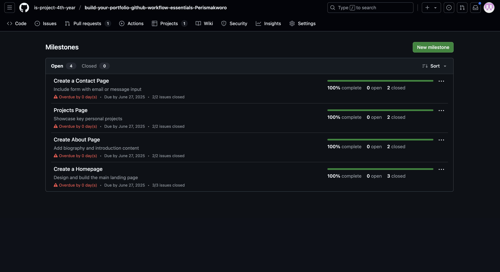
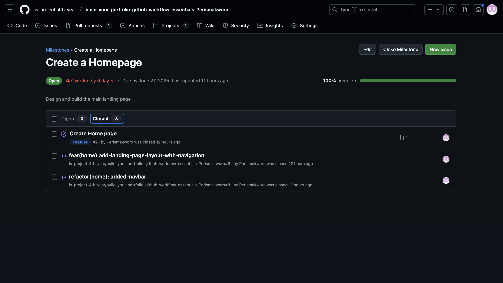
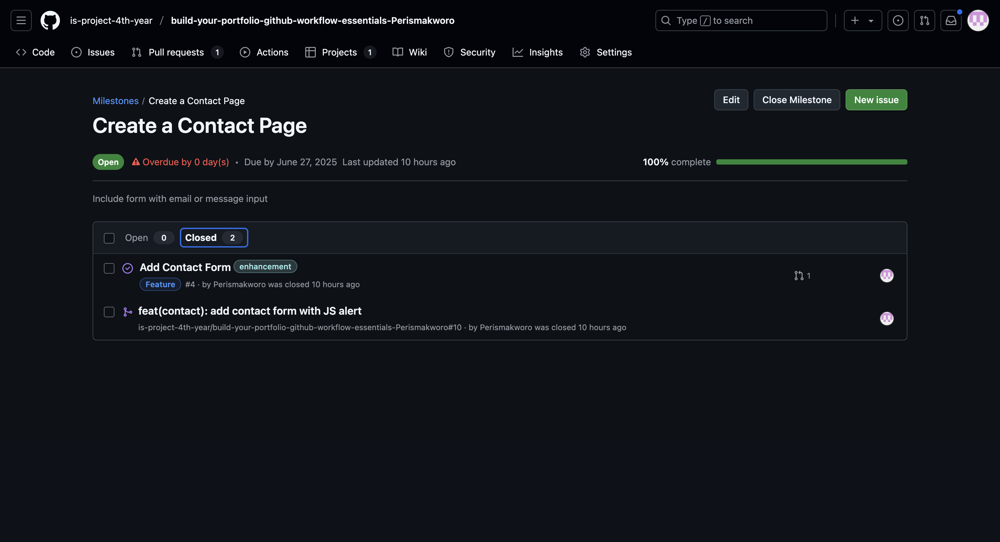
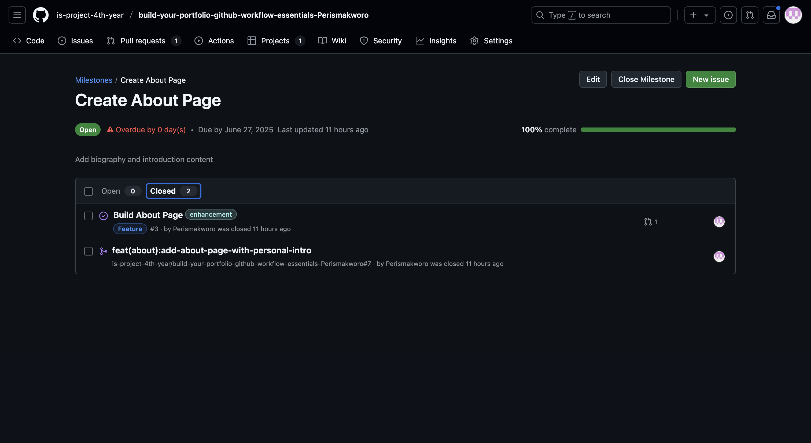
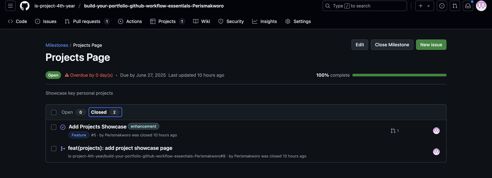
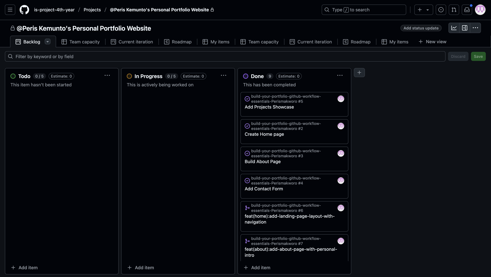
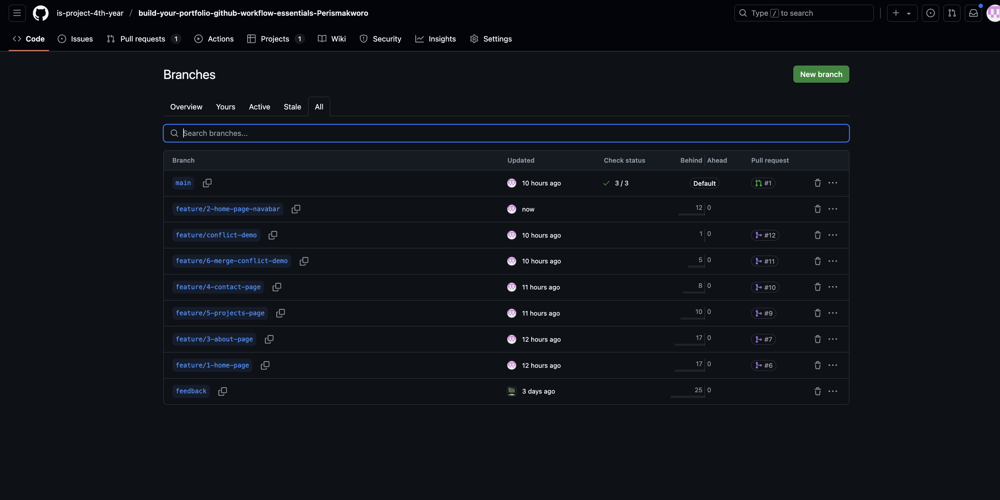
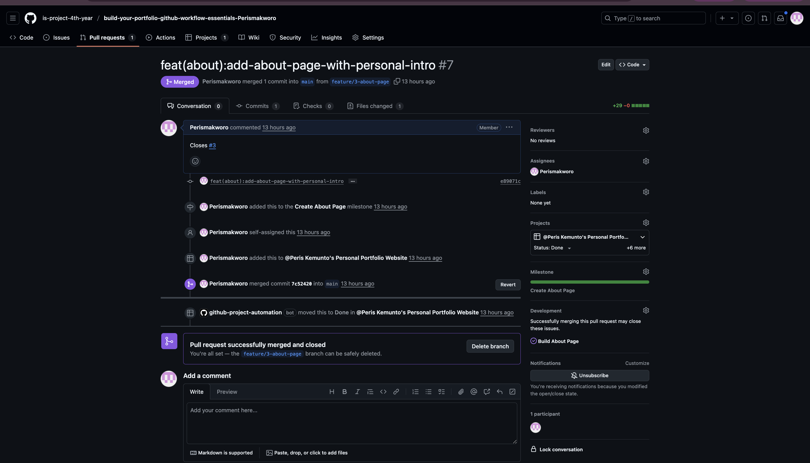
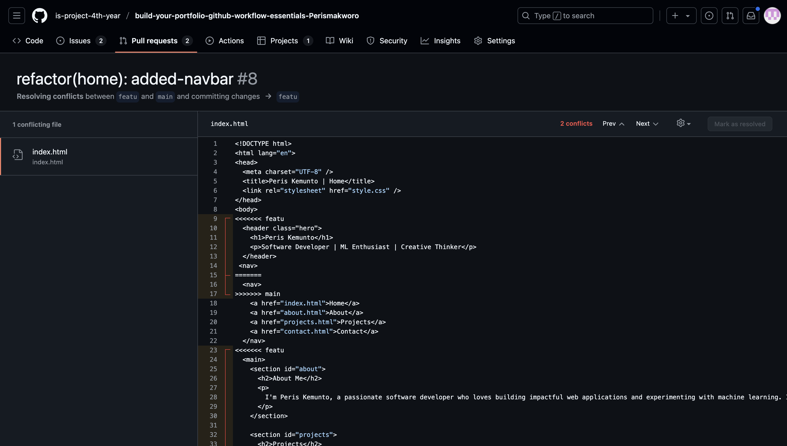
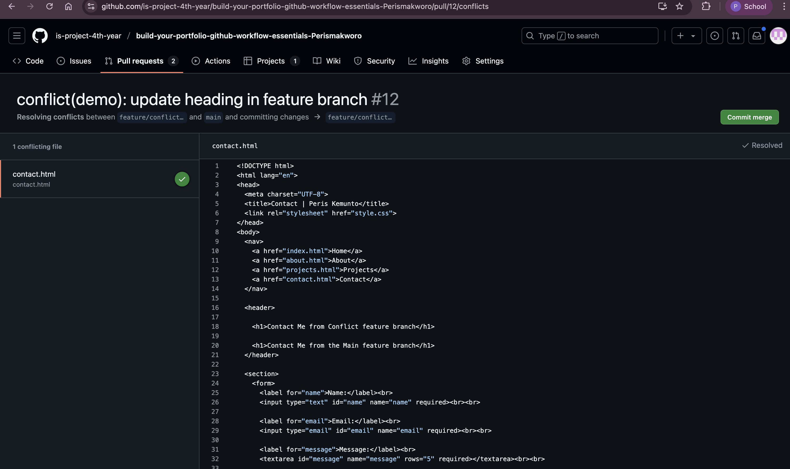

# Personal Portfolio Documentation

## 1. Student Details

- **Full Name**: Makworo Peris Kemunto 152135  
- **GitHub Username**: Perismakworo  
- **Email**: peris.makworo@strathmore.edu  

## 2. Deployed Portfolio Link

- **GitHub Pages URL**:  
   https://is-project-4th-year.github.io/build-your-portfolio-github-workflow-essentials-Perismakworo/

## 3. Learnings from the Git Crash Program

1. **Branching**: Helped me separate different tasks (like the Home, About, Projects, and Contact pages) into feature-specific branches. This reduced confusion and allowed me to work on sections independently without affecting the main site.

2. **Pull Requests**: Taught me how to propose and review changes before merging them. Using pull requests helped me track which issue each change addressed and made it easy to document my progress clearly.

3. **Commit Messages**: I learned how to write structured commit messages using conventions like `feat`, `fix`, or `chore`. This improved the readability of my Git history and made it easier to trace what each change did and which issue it was linked to.

4. **Merge Conflict Resolution**: I understood how merge conflicts occur when multiple branches edit the same line. I practiced resolving one manually using GitHub’s built-in conflict editor and committed the final resolved version, which is important in collaborative coding environments.

5. **GitHub Pages Deployment (bonus)**: Although not a core crash topic, I applied what I learned to deploy my site using GitHub Pages. I understood how to keep `main` always deployable and how to trigger automatic builds using the correct folder structure.

---

## 4. Screenshots of Key GitHub Features

### A. Milestones and Issues

  
This screenshot shows the milestone setup for my portfolio project. I created clear milestones for each major section (Home, About, Projects, Contact) to help divide the work into manageable deliverables.

  
This issue outlines the task for creating the home page. It is linked to its milestone and was the first feature branch I implemented.

  
This shows the issue for developing the Contact page. I used this to describe the expected content and linked it to a branch where I added a form and heading.

  
This shows the issue related to the About page. Documenting it as an issue allowed me to track the task’s progress and ensure it was tied to a feature branch.

  
This issue tracks the addition of the Projects section where I showcased past work. Linking this issue to a pull request helped ensure task traceability.

---

### B. Project Board

  
This is my GitHub project board. I used the columns "To Do", "In Progress", and "Done" to visually track task progress. As I worked on issues and submitted PRs, I moved the cards to the appropriate columns.

---

### C. Branching

  
This screenshot displays my project branches. I followed a naming convention like `feature/2-home-page` to keep branches organized. Each branch was tied to a specific issue, which helped isolate features and avoid breaking the main code.

---

### D. Pull Requests

  
This is a pull request for the about Page feature. It was linked to its issue and milestone, and included a structured commit message. Pull requests helped me review changes before merging and maintain clean collaboration practices.

---

### E. Merge Conflict Resolution

  
This is an example of a real merge conflict triggered when two branches edited the same part of `index.html`. GitHub flagged the conflict and paused the merge.

  
This shows a diffrent merge conflict after resolution in the `contact.html`. I manually edited the file using GitHub’s conflict editor to keep the correct version. I then committed the resolved file and completed the merge.

---
